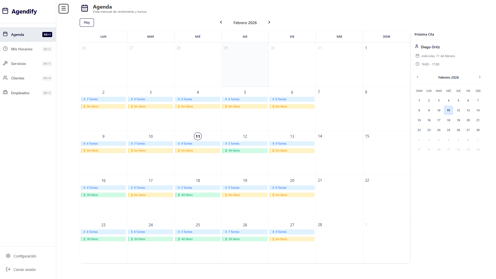
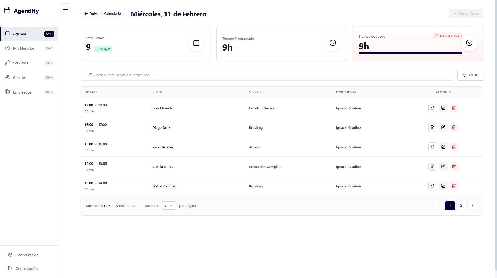
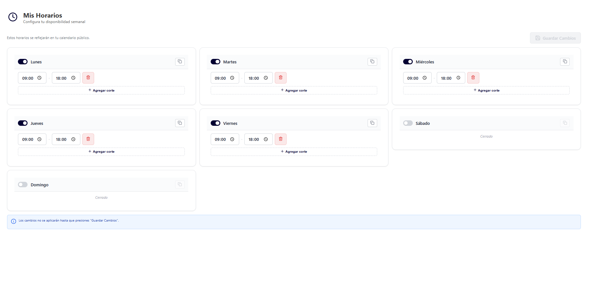
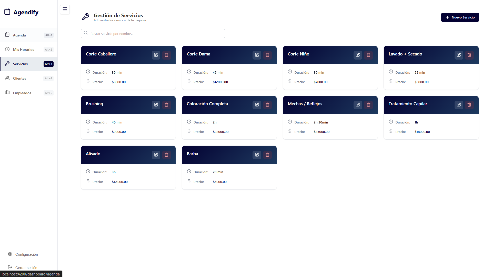

# 📅 Agendify

**Slogan:** Plataforma SaaS para la Gestión Centralizada de Turnos y Servicios.

---

## 📋 Tabla de Contenidos

- [¿Qué es Agendify?](#-qué-es-agendify)
- [Problemática que Resuelve](#-problemática-que-resuelve)
- [Funcionalidades Clave](#-funcionalidades-clave)
- [Capturas de Pantalla](#-capturas-de-pantalla)
- [Arquitectura y Stack Tecnológico](#-arquitectura-y-stack-tecnológico)
- [Requisitos Previos](#-requisitos-previos)
- [Instalación y Ejecución](#-instalación-y-ejecución)
- [Estructura del Proyecto](#-estructura-del-proyecto)
- [Características Técnicas](#-características-técnicas)
- [Testing](#-testing)
- [Documentación API](#-documentación-api)

---

## 🎯 ¿Qué es Agendify?

**Agendify** es una aplicación **SaaS (Software as a Service) Multi-tenant** diseñada para digitalizar y optimizar la operatividad de pequeños y medianos negocios de servicios (como barberías, consultorios, centros de estética, peluquerías, clínicas, etc.). 

Su misión es **eliminar el caos de las agendas en papel y las hojas de cálculo**, ofreciendo una solución **centralizada, trazable y profesional** para administrar el flujo de trabajo diario desde un único punto de control.

**"Canvas" Philosophy:** Total flexibilidad. Creá turnos rápidos sin estructura rígida, como si estuvieras escribiendo en una hoja de papel, pero con toda la potencia de un sistema inteligente.

---

## 🔍 Problemática que Resuelve

Los prestadores de servicios suelen enfrentar problemas críticos de desorganización:
- ❌ **Solapamiento de turnos** y conflictos de horarios
- ❌ **Falta de métricas** sobre rendimiento y productividad
- ❌ **Dificultad para gestionar** los horarios de múltiples empleados
- ❌ **Pérdida de información** de clientes y servicios
- ❌ **Ausencia de trazabilidad** en las operaciones diarias

**Agendify resuelve esto** proporcionando una **"fuente única de verdad"** donde conviven:
- ✅ La **disponibilidad del staff** (empleados/prestadores)
- ✅ El **catálogo completo de servicios** con duraciones y precios
- ✅ La **base de datos de clientes** con historial
- ✅ **Métricas en tiempo real** del negocio

---

## ⚡ Funcionalidades Clave

### 📅 **Agenda Inteligente & Métricas Diarias**
Ofrece una **visualización mensual** para el panorama general y una **vista de Detalle Diario** avanzada. Esta última no solo lista los turnos, sino que funciona como un **tablero de control**, mostrando:
- Cantidad de turnos del día
- Tiempo programado vs. tiempo libre
- Comparativas de rendimiento
- Filtros por horarios y búsqueda en tiempo real

### ⚙️ **Gestión Granular de Disponibilidad**
Permite a cada prestador configurar su **Disponibilidad Semanal** con precisión quirúrgica:
- Rangos horarios complejos por día
- Soporte para "cortes" (breaks) para almuerzos o descansos
- Activación/desactivación de días completos
- Impacto directo en la capacidad de agenda del negocio

### ✂️ **Administración de Servicios y Clientes**
- **Catálogo de Servicios:** Define servicios con duración estimada y precio, lo cual automatiza el cálculo de bloques de tiempo en la agenda
- **Gestión de Clientes:** Registro completo con historial de turnos, datos de contacto y notas
- **Turnos Flexibles:** Permite crear turnos con clientes registrados o walk-ins (clientes ocasionales)

### 🔒 **Arquitectura Multi-Inquilino (Multi-tenant)**
Construido para **escalar**, el sistema garantiza el **aislamiento total de datos** entre diferentes negocios, permitiendo que múltiples empresas utilicen la plataforma de manera segura e independiente.

### 🛡️ **Validaciones Inteligentes**
- Prevención automática de **solapamientos de turnos**
- Validación de **conflictos de horarios** de empleados
- Verificación de **disponibilidad del prestador**
- Sistema de **errores descriptivos** con Problem Details (RFC 7807)

### 🚀 **Onboarding Automático**
Al registrarte, el sistema automáticamente:
1. Crea tu negocio
2. Configura tu primer prestador de servicios
3. Te otorga acceso completo al sistema

---

## 📸 Imagenes de la Aplicación

### **Calendario Mensual**
Vista general del mes con resumen de turnos por día.



---

### **Detalle Diario**
Panel de control con métricas en tiempo real, listado de turnos y filtros avanzados.



---

### **Gestión de Horarios**
Configuración granular de disponibilidad semanal por empleado con soporte para breaks.



---

### **Catálogo de Servicios**
Administración de servicios con duración y precios.



---

## 🏗️ Arquitectura y Stack Tecnológico

### **Backend**
- **Framework:** .NET 10 (C#)
- **Base de Datos:** SQL Server 2022
- **ORM:** Entity Framework Core 10.0.1
- **Autenticación:** JWT Bearer Authentication
- **Validación:** FluentValidation 11.3.0
- **Manejo de Resultados:** FluentResults 4.0.0
- **API Documentation:** Swagger/OpenAPI (Swashbuckle 6.6.2)
- **Arquitectura:** Arquitectura en capas con separación de responsabilidades
  - Controllers
  - Services (Business Logic)
  - Repositories (Data Access)
  - DTOs (Data Transfer Objects)
  - Validators (FluentValidation)
  - Middleware (Exception Handling)

**Patrones y Prácticas:**
- Result Pattern para manejo de errores
- Repository Pattern
- Dependency Injection
- Fluent API (EF Configuration)
- Snake_case naming en JSON
- Converters personalizados (DateTime, TimeSpan)

### **Frontend**
- **Framework:** Angular 21.1.0
- **Lenguaje:** TypeScript 5.9.2
- **UI Framework:** PrimeNG 21.1.1
- **Calendario:** FullCalendar 6.1.20
- **Iconos:** Lucide Angular 0.563.0
- **Reactividad:** RxJS 7.8.0 + Signals
- **Estilos:** CSS modular + Tailwind CSS (configuración implícita)
- **Build:** Angular CLI 21.1.0
- **Testing:** Vitest 4.0.8

**Arquitectura:**
- Componentes reutilizables y genéricos
- Guards para protección de rutas
- Interceptors (Auth, Case Converter)
- Services con inyección de dependencias
- Helpers para manejo de errores y fechas
- Pipes personalizados (UTC to Local)

### **Testing**
- **Framework:** xUnit
- **Mocking:** Moq
- **Assertions:** FluentAssertions
- **Cobertura:** Controladores, Servicios, Repositorios, Validadores

### **DevOps & Infraestructura**
- **Containerización:** Docker
- **Orquestación:** Docker Compose
- **Base de Datos:** SQL Server en contenedor
- **Web Server (Frontend):** Nginx
- **Health Checks:** Configurados para SQL Server

---

## 📦 Requisitos Previos

Antes de iniciar, asegúrate de tener instalado:

- **Docker Desktop** (para Windows/Mac) o **Docker Engine** (para Linux)
  - [Descargar Docker](https://www.docker.com/products/docker-desktop/)
- **Git** (para clonar el repositorio)
  - [Descargar Git](https://git-scm.com/)
- *Opcional:* **.NET 10 SDK** (solo para desarrollo local sin Docker)
  - [Descargar .NET](https://dotnet.microsoft.com/download)
- *Opcional:* **Node.js 20+** (solo para desarrollo local sin Docker)
  - [Descargar Node.js](https://nodejs.org/)

---

## 🚀 Instalación y Ejecución

### **Paso 1: Clonar el Repositorio**

```bash
git clone <url-del-repositorio>
cd Agendify
```

### **Paso 2: Configurar Variables de Entorno**

1. En la raíz del proyecto, copia el archivo de ejemplo:
   ```powershell
   Copy-Item .env.example .env
   ```

2. Edita el archivo `.env` con tus valores:
   ```dotenv
   # SQL Server
   MSSQL_SA_PASSWORD=TuPasswordSegura123!
   MSSQL_PID=Express
   SQL_PORT=1433

   # Database
   DB_SERVER=sqlserver
   DB_PORT=1433
   DB_NAME=AgendifyDb
   DB_USER=sa
   DB_PASSWORD=TuPasswordSegura123!

   # API
   API_HTTP_PORT=5000
   ASPNETCORE_ENVIRONMENT=Development
   ASPNETCORE_URLS=http://+:8080

   # JWT (Generar una clave segura de al menos 64 caracteres)
   JWT_SECRET=TuClaveSecretaSuperLargaYSeguraDeAlMenos64CaracteresParaJWT123456789!
   JWT_ISSUER=Agendify
   JWT_AUDIENCE=AgendifyUsers

   # Frontend
   FRONTEND_PORT=4200
   ```

### **Paso 3: Levantar la Aplicación con Docker Compose**

Desde la raíz del proyecto:

```powershell
docker-compose up --build
```

Este comando hará lo siguiente:
1. ✅ Levantará **SQL Server** en el puerto 1433
2. ✅ Construirá y levantará el **Backend API** en el puerto 5000
3. ✅ Construirá y levantará el **Frontend** en el puerto 4200

**Tiempos estimados:**
- Primera vez (con build): 5-10 minutos
- Siguientes veces: 1-2 minutos

### **Paso 4: Aplicar Migraciones de Base de Datos**

Una vez que los contenedores estén corriendo, aplica las migraciones:

**Opción A: Usando el script PowerShell (recomendado)**
```powershell
.\apply-migrations.ps1
```

**Opción B: Manualmente**
```powershell
docker exec -it agendify-api dotnet ef database update
```

### **Paso 5: Acceder a la Aplicación**

- **Frontend:** http://localhost:4200
- **Backend API:** http://localhost:5000
- **Swagger UI:** http://localhost:5000/swagger

---

## 📂 Estructura del Proyecto

```
Agendify/
│
├── Backend/                          # API .NET
│   ├── Agendify/                     # Proyecto principal
│   │   ├── Controllers/              # Endpoints REST
│   │   ├── Services/                 # Lógica de negocio
│   │   ├── Repositories/             # Acceso a datos
│   │   ├── DTOs/                     # Data Transfer Objects
│   │   ├── Models/Entities/          # Entidades del dominio
│   │   ├── Validators/               # FluentValidation
│   │   ├── Middleware/               # Exception Handling
│   │   ├── Data/                     # DbContext & Configuraciones
│   │   ├── Extensions/               # Métodos de extensión
│   │   ├── Common/                   # Converters, Errors
│   │   └── Migrations/               # EF Core Migrations
│   │
│   ├── TestAgendify/                 # Tests unitarios (xUnit)
│   └── Dockerfile                    # Dockerfile del Backend
│
├── Frontend/                         # Aplicación Angular
│   ├── src/
│   │   ├── app/
│   │   │   ├── components/           # Componentes UI
│   │   │   │   ├── agenda/           # Vista de agenda
│   │   │   │   ├── auth/             # Login/Register
│   │   │   │   ├── clientes/         # Gestión de clientes
│   │   │   │   ├── empleados/        # Gestión de empleados
│   │   │   │   ├── servicios/        # Catálogo de servicios
│   │   │   │   └── dashboard/        # Panel principal
│   │   │   ├── services/             # Servicios HTTP
│   │   │   ├── guards/               # Auth guards
│   │   │   ├── interceptors/         # HTTP interceptors
│   │   │   ├── models/               # Interfaces TypeScript
│   │   │   ├── helpers/              # Utilidades
│   │   │   └── pipes/                # Pipes personalizados
│   │   └── environments/             # Configuración por entorno
│   └── Dockerfile                    # Dockerfile del Frontend
│
├── docker-compose.yml                # Orquestación completa
├── .env.example                      # Template de variables
├── .env                              # Variables de entorno (gitignored)
└── README.md                         # Este archivo
```

---

## 🔧 Características Técnicas

### **Backend**

#### **Endpoints Principales**

| Módulo | Endpoint | Descripción |
|--------|----------|-------------|
| Auth | `POST /api/auth/register` | Registro de usuario + creación de negocio |
| Auth | `POST /api/auth/login` | Login con JWT |
| Appointments | `GET/POST/PUT/DELETE /api/appointments` | CRUD de turnos |
| Calendar | `GET /api/calendar/summary` | Resumen mensual |
| Calendar | `GET /api/calendar/day/{date}` | Detalle diario con métricas |
| Providers | `GET/POST/PUT/DELETE /api/providers` | Gestión de empleados |
| Schedules | `PUT /api/providerschedules/me/bulk-update` | Actualización masiva de horarios |
| Services | `GET/POST/PUT/DELETE /api/services` | Catálogo de servicios |
| Customers | `GET/POST/PUT/DELETE /api/customers` | Gestión de clientes |

#### **Seguridad**
- JWT Bearer Authentication
- Claims-based authorization (BusinessId, ProviderId, UserId)
- Password hashing con algoritmos seguros
- Validación de tokens con emisor y audiencia
- HTTPS recomendado en producción

#### **Convenciones**
- **JSON Naming:** snake_case (ej: `provider_id`, `start_time`)
- **HTTP Status Codes:** Uso correcto de 200, 201, 204, 400, 404, 409, 500
- **Problem Details:** RFC 7807 para errores estructurados
- **DateTime:** Manejo de zonas horarias con converters personalizados

### **Frontend**

#### **Módulos Principales**
- **Auth Module:** Login, registro, landing page
- **Agenda Module:** Calendario mensual + detalle diario
- **Empleados Module:** Gestión de prestadores y horarios
- **Clientes Module:** ABM de clientes
- **Servicios Module:** Catálogo de servicios

#### **Características**
- Autenticación con JWT (almacenamiento seguro)
- Interceptor para agregar token automáticamente
- Conversión automática de snake_case ↔ camelCase
- Manejo centralizado de errores
- Componentes reutilizables genéricos
- Validación de formularios reactivos

---

## 🧪 Testing

El proyecto incluye tests unitarios completos para el backend:

### **Ejecutar Tests**

**Con Docker:**
```powershell
docker exec -it agendify-api dotnet test
```

**Sin Docker (local):**
```powershell
cd Backend
dotnet test
```

### **Cobertura de Tests**
- ✅ Controllers (AppointmentsController, ServicesController, ProvidersController, etc.)
- ✅ Services (lógica de negocio)
- ✅ Repositories (acceso a datos)
- ✅ Validators (FluentValidation)

**Herramientas:**
- xUnit (framework)
- Moq (mocking)
- FluentAssertions (assertions expresivas)

---

## 📚 Documentación API

### **Swagger/OpenAPI**

Una vez levantado el backend, accede a la documentación interactiva:

**URL:** http://localhost:5000/swagger

Desde Swagger puedes:
- 📖 Ver todos los endpoints disponibles
- 🧪 Probar requests directamente
- 🔐 Autenticarte con JWT
- 📋 Ver schemas de DTOs

### **Autenticación en Swagger**

1. Registrate o inicia sesión usando `/api/auth/register` o `/api/auth/login`
2. Copia el `access_token` de la respuesta
3. Click en el botón **"Authorize"** en Swagger
4. Pega el token (sin el prefijo "Bearer")
5. Ahora puedes probar endpoints protegidos

---

## 🛠️ Desarrollo Local (Sin Docker)

Si prefieres desarrollar sin Docker:

### **Backend**

1. Instala SQL Server localmente
2. Actualiza `appsettings.Development.json` con tu connection string
3. Aplica migraciones:
   ```powershell
   cd Backend\Agendify
   dotnet ef database update
   ```
4. Ejecuta la API:
   ```powershell
   dotnet run
   ```

### **Frontend**

1. Instala dependencias:
   ```powershell
   cd Frontend
   npm install
   ```
2. Actualiza `src/environments/environment.ts` con la URL de tu API
3. Ejecuta el servidor de desarrollo:
   ```powershell
   npm start
   ```
4. Accede a: http://localhost:4200

---
**¡Gracias por usar Agendify! 🚀**
